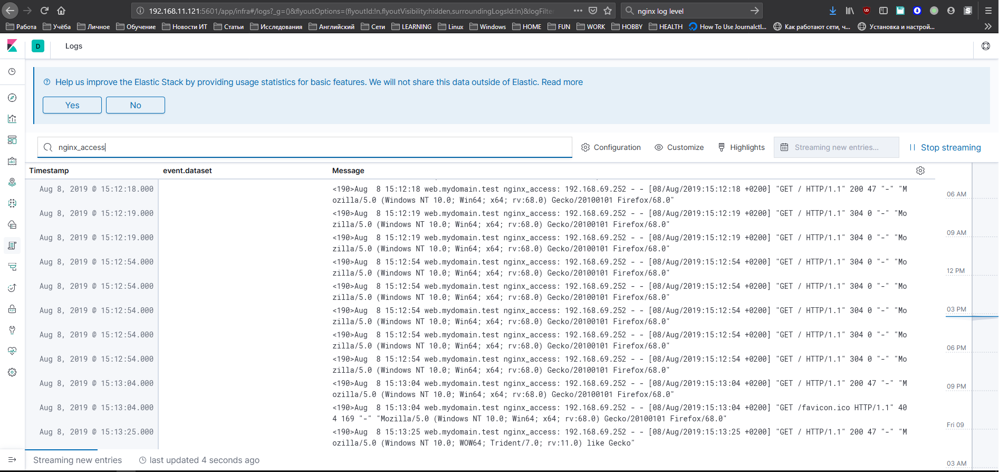
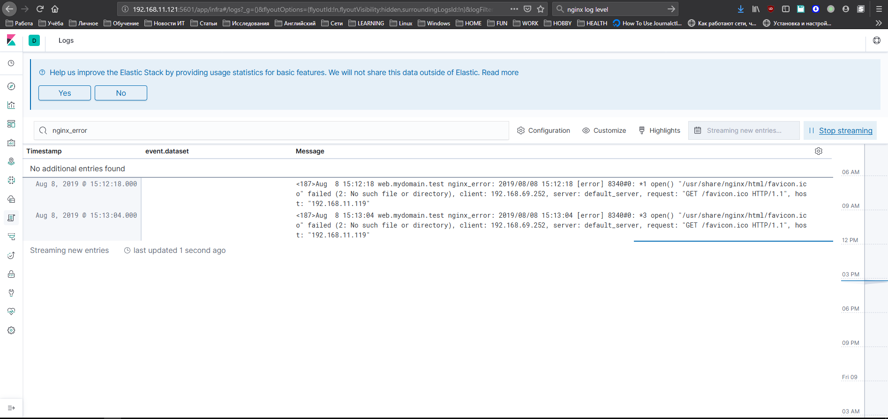

#### Сбор и анализ логов


##### Задание:
Настроить центральный сервер для сбора логов:
  - в Vagrant поднять 2 машины: web и log;
  - на web поднять nginx;
  - на log настроить центральный log-сервер используя на выбор:
    - journald
    - rsyslog
    - ELK
  - настроить аудит, следящий за изменением конфигов nginx;
  - логи аудита должны уходить ТОЛЬКО на удаленную систему.
  - все критичные логи с web должны собираться и локально и удаленно;
  - все логи с nginx должны уходить на удаленный сервер (локально только критичные);


Дополнительно:
  - развернуть еще одну машину с ELK и, таким образом, настроить две(!) центральных лог системы: ELK и ту, что настроили ранее;
  - в ELK должны уходить только логи nginx, а во вторую - всё остальное. 


##### Решение.

#### 1. AuditD
[Сервис auditd](ansible_repo/roles/auditd_server/tasks/main.yml) слушает на 60 порту log.mudomain.test. В свою очередь web.mydomain.test [отправляет все сообщения](ansible_repo/roles/auditd_client/tasks/main.yml) auditd на сервер log.mydomain.test, [не сохраняя](ansible_repo/roles/auditd_client/tasks/main.yml#L22-L26) при этом ничего локально.

Проверка:
 - на web.mydomain.test выполнить ```touch /etc/nginx/nginx.conf```
 - на log.mydomain.test выполнить ```ausearch -k ngnix-config-modified```

#### 2. JournalD
На сервере log.mydomain.test настроен [сервис systemd-journal-remote](ansible_repo/roles/sd_jd_server/tasks/main.yml) для принятия логов от удаленных систем. На сервере web.mydomain.test настроен [systemd-journal-upload](ansible_repo/roles/sd_jd_client/tasks/main.yml), который отправляет логи на log.mydomain.test. При этом, на web.mydomain.test демон [systemd-journald настроен](ansible_repo/roles/sd_jd_client/tasks/main.yml#L34-L44) таким образом, чтобы фиксировать локально и отправлять на удаленный сервер только события с критичностью 2 (critical) и выше.

Проверка:
 - на сервере логов log.mydomain.test запустить ```journalctl -D /var/log/journal/remote/ -f```
 - на web.mydomain.test запустить, к примеру, ```logger -p 2``` и набрать тестовое сообщение, которое должно сразу отобразиться в логах на сервере log.mydomain.test

#### 3. ELK
На сервере elk.mydomain.test подняты [elasticsearch, kibana и logstash](ansible_repo/roles/install_elk/tasks/main.yml).
На сервере web.mydomain.test установлен [nginx](ansible_repo/roles/install_nginx/tasks/main.yml) (порт 80), все [логи](ansible_repo/roles/install_nginx/templates/nginx.conf.j2) которого отправляются в logstash, но критичные логи ошибок ещё и сохраняются локально.

Metric indices: nginx-*
Log indices: *

Вывод фильтра nginx_access из лога nginx:


Вывод фильтра nginx_errors из лога nginx:
