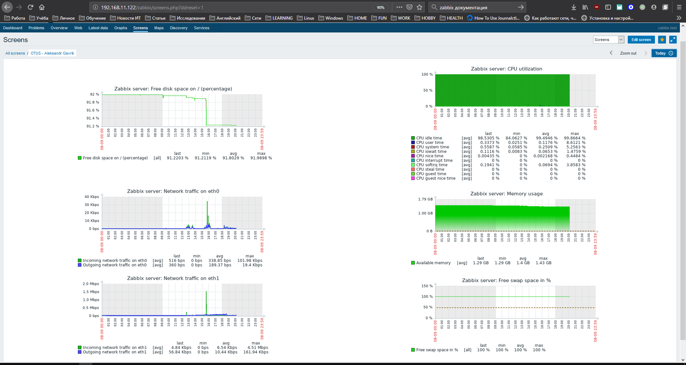
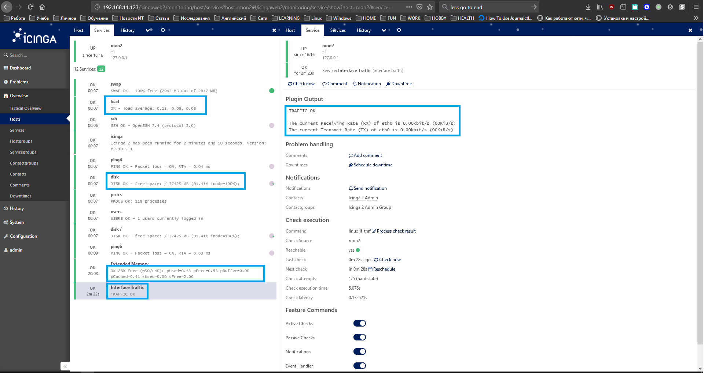

#### Настройка мониторинга

##### Задание

Настроить dashboard с 4-мя графиками на Zabbix (+screen) или Prometheus (+Grafana):
  - использование RAM;
  - нагруженность CPU;
  - нагрузка на дисковую подсистему;
  - нагруженность сетевого интерфейса;
Прислать результат в виде скриншота экрана с именем приславшего в заголовке dashboard.

Дополнительно:
 - использовать систему, пример которой не рассматривался на занятии (список возможных систем приведен в презентации)

##### Итоговые скриншоты

1. Zabbix

2*. Icinga2

