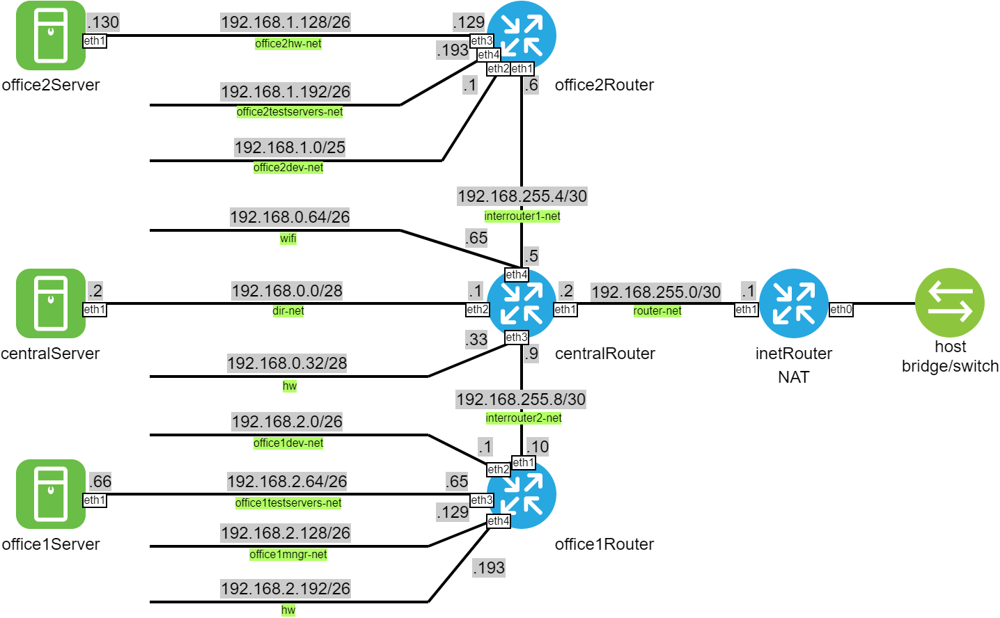

#### Сетевая архитектура

##### Задание

Построить следующую архитектуру:
 - Сеть office1:
  - 192.168.2.0/26 - dev
  - 192.168.2.64/26 - test servers
  - 192.168.2.128/26 - managers
  - 192.168.2.192/26 - office hardware
 - Сеть office2:
  - 192.168.1.0/25 - dev
  - 192.168.1.128/26 - test servers
  - 192.168.1.192/26 - office hardware
 - Сеть central:
  - 192.168.0.0/28 - directors
  - 192.168.0.32/28 - office hardware
  - 192.168.0.64/26 - wifi

Примерная схема:

```
Office1 ---\
            -----> Central --IRouter --> internet
Office2----/
```

Итого, должны получиться следующие виртуальные машины:
 - inetRouter
 - centralRouter
 - office1Router
 - office2Router
 - centralServer
 - office1Server
 - office2Server

Теоретическая часть:
 - Найти свободные подсети;
 - Подсчитать, сколько узлов в каждой подсети, включая свободные;
 - Указать broadcast-адрес для каждой подсети;
 - Проверить, нет ли ошибок при разбиении.

Практическая часть:
- Соединить офисы в сеть согласно схеме и настроить роутинг;
- Все серверы и роутеры должны ходить в Интернет черз inetRouter;
- Все серверы должны видеть друг друга;
- У всех новых серверов отключить дефолт на NAT (eth0), который Vagrant поднимает для связи;
- При нехватке сетевых интерфейсов добавлять по несколько адресов на интерфейс.

##### Решение

| Имя сети | Суммарная подсеть | Отдел | Выделенная подсеть | Broadcast-адрес | Узлов |
|----------|-------------------|-------|--------------------|-----------------|-------|
| central | 192.168.0.0/24 | directors | 192.168.0.0/28 | 192.168.0.15 | 14 |
| central | 192.168.0.0/24 | СВОБОДНО | 192.168.0.16/28 | 192.168.0.31 | 14 |
| central | 192.168.0.0/24 | office hw | 192.168.0.32/28 | 192.168.0.47 | 14 |
| central | 192.168.0.0/24 | СВОБОДНО | 192.168.0.48/28 | 192.168.0.63 | 14 |
| central | 192.168.0.0/24 | wifi | 192.168.0.64/26 | 192.168.0.127 | 62 |
| central | 192.168.0.0/24 | СВОБОДНО | 192.168.0.128/25 | 192.168.0.255 | 126 |
| office2 | 192.168.1.0/24 | dev | 192.168.1.0/25 | 192.168.1.127 | 126 |
| office2 | 192.168.1.0/24 | test servers | 192.168.1.128/26 | 192.168.1.191 | 62 |
| office2 | 192.168.1.0/24 | office hw | 192.168.1.192/26 | 192.168.1.255 | 62 |
| office1 | 192.168.2.0/24 | dev | 192.168.2.0/26 | 192.168.2.63 | 62 |
| office1 | 192.168.2.0/24 | test servers | 192.168.2.64/26 | 192.168.2.127 | 62 |
| office1 | 192.168.2.0/24 | managers | 192.168.2.128/26 | 192.168.2.191 | 62 |
| office1 | 192.168.2.0/24 | office hw | 192.168.2.192/26 | 192.168.2.255 | 62 |

Ошибок при разбиении нет, но, на мой взгляд, лучше было не допускать такого мелкого дробления на подсети в 192.168.0.0/24. Также, логичнее и удобнее работать с адресами было бы при соответствии третьего октета номеру офиса (office1 - 192.168.1.0/24, например).

Схема сети:

