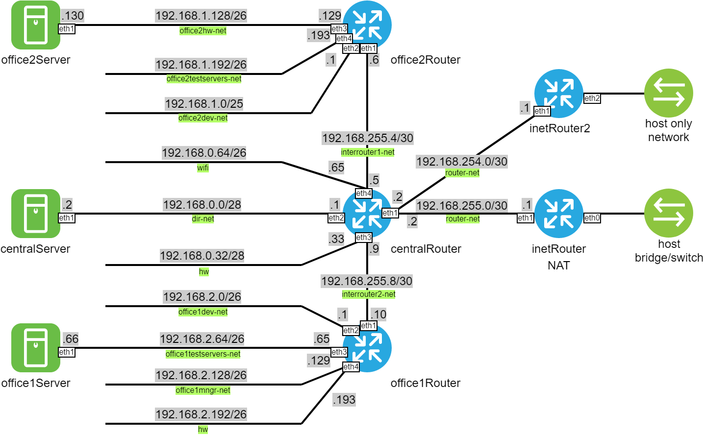

#### Сценарии iptables

#### Задание

 - реализовать "knocking port": centralRouter может попасть на ssh inetRouter через knock-скрипт;
 - добавить inetRouter2, который виден с хоста (host-only network) или форвардится порт через localhost;
 - запустить nginx на centralServer и пробросить порт 80 на inetRouter2 порт 8080;
 - выход в Интернет в сети оставить через inetRouter.

Дополнительно:
 - реализовать проход на 80й порт без маскарадинга.

#### Реализация

 - Сделан [knocking port](Vagrantfile#L118-L144). [Скрипт](knock.sh) для проверки: ```/vagrant/knock.sh 192.168.255.1 6699 9966```;
 - inetRouter2 добавлен. [Проброс порта](Vagrantfile#L155-L158) inetRouter2 eth2:8080 на centralRouter:80 выполнен без маскарада;
 - nginx запущен;
 - выход в интернет все также проходит через inetRouter.

Схема сети:

