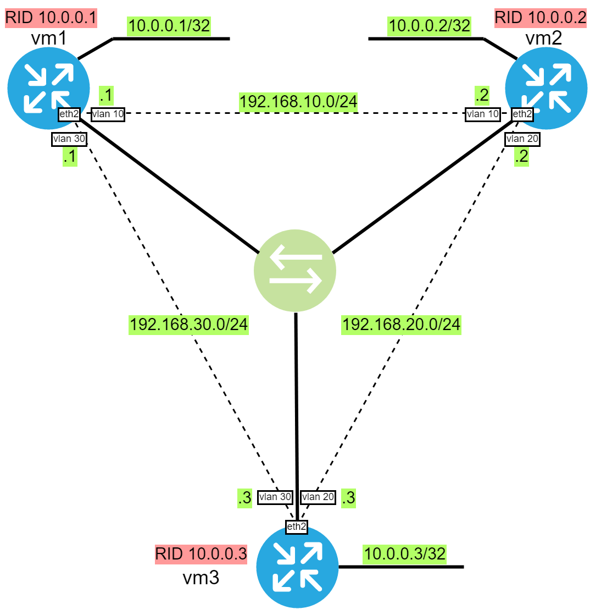
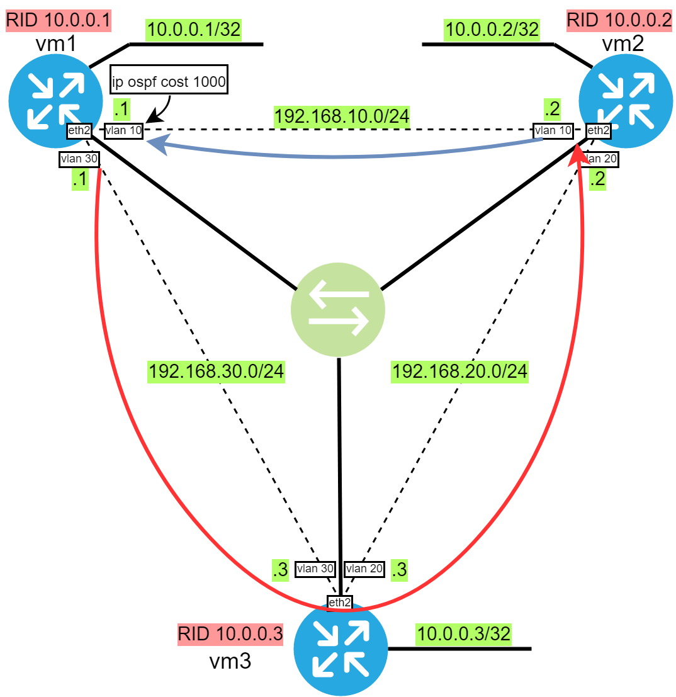
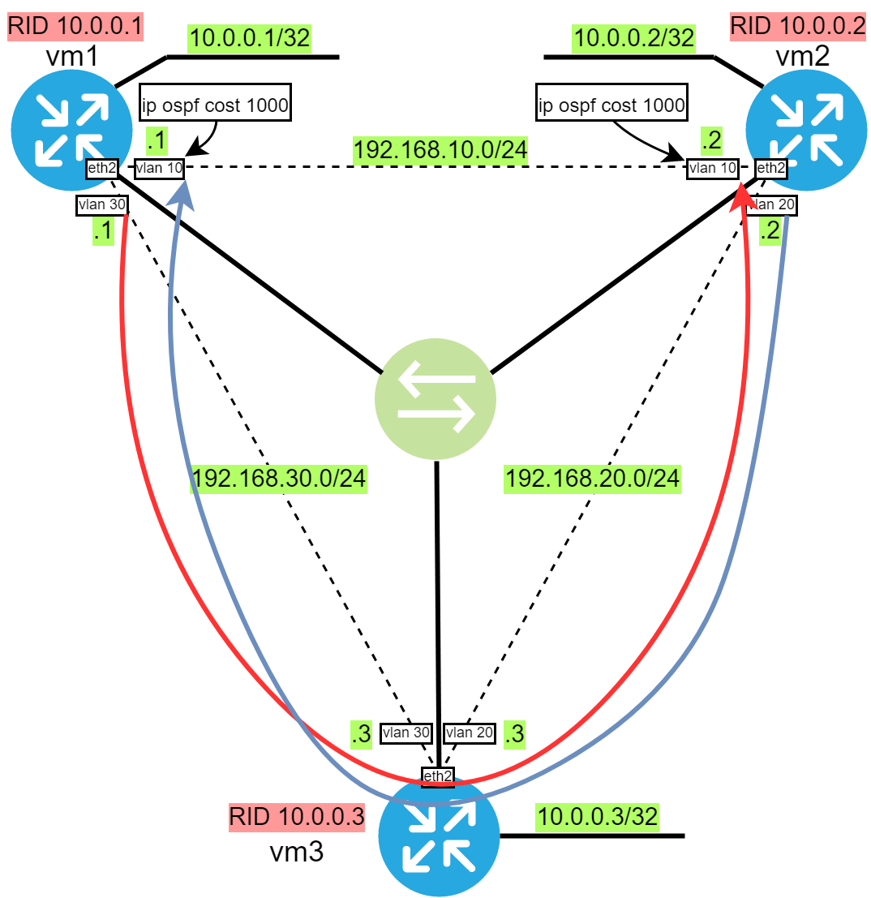

#### OSPF

#### Задание

- Поднять три виртуальных машины и объединить их разными vlan;
- Поднять OSPF между машинами на базе Quagga;
- Изобразить ассиметричный роутинг;
- Сделать один из линков "дорогим", но что бы при этом роутинг был симметричным;
- Формат сдачи: Vagrantfile + ansible. 

#### Решение

На стенде настроены vlanы, добавлены loopback-и для наглядности и поднят OSPF: все согласно приведенной ниже схеме.

Схема сети:

Для корректной работы ассиметричного роутинга включена слабая фильтрация rp_filter.

Если, к примеру, в настройках OSPF vm1 на интерфейсе eth2.10 поднять цену до 1000, то исходящий трафик пойдет не кратчайшим марщрутом, а в обход, но при этом ответный трафик пойдёт кратчашим маршрутом, как изображено ниже:

И если теперь в настройках OSPF vm2 на интерфейсе eth2.10 также поднять цену до 1000, то маршрутизация станет симметричной, но весь трафик (и прямой, и обратный) пойдет через маршрутизатор vm3.

