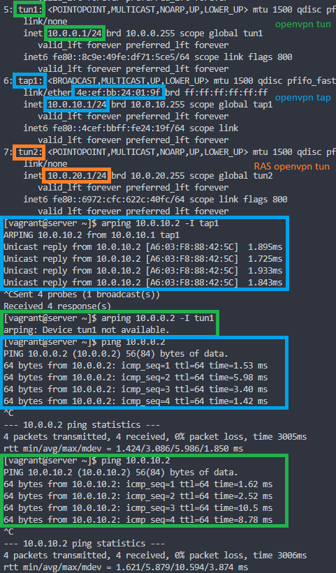

#### VPN

#### Задание

1. Между двумя виртуальными машинами поднять OpenVPN в режимах tun и tap. Описать разницу;
2. Поднять RAS на базе OpenVPN с авторизацией по сертификатам и подключиться с локальной машины на виртуальную машину.

Дополнительно:

3. Изучить ocserv, поднять сервер и подключиться к нему с локальной машины.

#### Результат

Vagrant + Ansible, который:
  - поднимает сервер CA на server;
  - генерирует серверные сертификаты на server;
  - генерирует клиентские сертификаты на client;
  - поднимает на server сервер openvpn на порту 1194/udp в режиме tap;
  - поднимает на server сервер openvpn на порту 1194/tcp в режиме tun;
  - поднимает на client клиент openvpn к server:1194/udp в режиме tap;
  - поднимает на client клиент openvpn к server:1194/есз в режиме tun;
  - поднимает на server сервер openvpn на порту 1195/tcp в режиме tun авторизацией по сертификату, имени пользователя и паролю ([подтверждение поключения с хоста](pics/ovpn_ras.png));
  - поднимает на server сервер ocserv на порту 443/tcp c авторизацией по имени пользователя и паролю ([подтверждение поключения с хоста](pics/ocserv_ras.png));

Для проверки RAS OpenVPN можно использовать сертификаты, которые автоматически сгенерируются в /tmp/server на локальной машине. Пример конфигурации клиента для проверки [тут](sample/test.ovpn). Имя пользователя и пароль - vagrant / vagrant. Ту же пару логин / пароль можно использовать для проверки работоспособности ocserv client.

Схема сети:

Разница tun и tap режимов:

- TAP:
  - Преимущества:
    - ведёт себя как настоящий сетевой адаптер (за исключением того, что он виртуальный);
    - может осуществлять транспорт любого сетевого протокола (IPv4, IPv6, IPX и прочих);
    - работает на 2 уровне, поэтому может передавать Ethernet-кадры внутри тоннеля;
    - позволяет использовать мосты.
  - Недостатки:
    - в тоннель попадает broadcast-трафик, что иногда не требуется;
    - добавляет свои заголовки поверх заголовков Ethernet на все пакеты, которые следуют через тоннель;
    - в целом, менее масштабируем из-за предыдущих двух пунктов;
    - не поддерживается устройствами Android и iOS (по информации с сайта OpenVPN).
- TUN:
  - Преимущества:
    - передает только пакеты протокола IP (3й уровень);
    - сравнительно (отн. TAP) меньшие накладные расходы и, фактически, ходит только тот IP-трафик, который предназначен конкретному клиенту.
  - Недостатки:
    - broadcast-трафик обычно не передаётся;
    - нельзя использовать мосты.  

Наглядный пример с MAC: cиним выделен адаптер tap1 - у него есть MAC-адрес, а у зеленого (tun1) MAC адреса нет.
