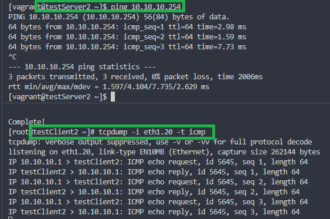

#### Bonds and VLANs

#### Задание

В тестовой подсети Office1 появляются новые серверы с дополнительными интерфейсами и адресами:
- в сети office1testservers-net поверх существующей физической сети:
  - testServer1, ip: 10.10.10.1, vlan: 10
  - testServer2, ip: 10.10.10.1, vlan: 20
  - testClient1, ip: 10.10.10.254, vlan 10
  - testClient2, ip: 10.10.10.254, vlan 20

- в сети между centralRouter и inetRouter сделать 2 виртульных канала, объединить их в bond и проверить их работу методом отключения интерфейсов.

Работу сдать в формате Vagrant + ansible.

#### Решение

За основу взят проверенный стенд из [Лабораторной работы №17](https://github.com/mbfx/otus-linux/tree/master/lab17). Он будет доработан в процессе выполнения этой работы. 

##### Схема VLANs:

##### Проверка работоспособности vlan10:

##### Проверка работоспособности vlan20:

##### Схема bond между inetRouter и centralRouter

##### Проверка состояния bond0:

##### Вывод cat /proc/net/bonding/bond0:
Поскольку на сетевых картах виртуальных машин недоступен механизм MII, для детектирования доступности интерфейсов используется протокол ARP.

##### Проверка работоспособности bond0:

