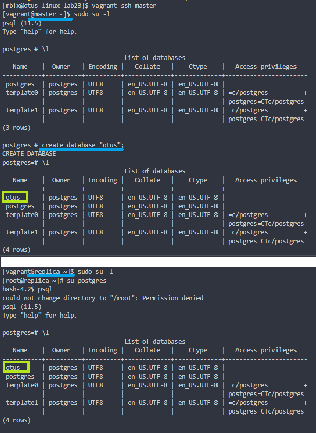

#### PostgreSQL

#### Задание

- Настроить hot_standby репликацию с использованием слотов;
- Настроить правильное резервное копирование.

Для сдачи работы прислать ссылку на репозиторий, в котором должны обязательно быть:
- Vagranfile и плейбук Ansible;
- конфигурационные файлы postgresql.conf, pg_hba.conf и recovery.conf;
- конфиг barman, либо скрипт резервного копирования.

Команда "vagrant up" должна поднимать машины с настроенной репликацией и резервным копированием. Рекомендуется в README.md файл вложить результаты (текст или скриншоты) проверки работы репликации и резервного копирования.

#### Результат

Приложен Vagrantfile с Ansible provision, который развертывает 3 машины: master, replica и backup:
 - [Vagrantfile](Vagrantfile);
 - [Ansible repo](ansible_repo/roles);
 - [postgresql.conf](ansible_repo/roles/pg_replication/templates/postgresql-master.conf.j2);
   - после развёртывания barman параметр ```archive_command``` примет вид ```'barman-wal-archive {{ backup_hostname }}.{{ domain }} {{ replica_hostname }}.{{ domain }} %p'```
 - [recovery.conf](ansible_repo/roles/pg_replication/templates/recovery.conf.j2);
 - отдельного файла pg_hba.conf нет, т.к. ansible сам проверяет наличие нужных строк на нужных нодах, например, на master это :
   - ```host replication all 192.168.11.151/32 trust```
   - ```host all barman 192.168.11.152/32 md5```
   - ```host replication barman_streaming_user 192.168.11.152/32 md5```
 - [/etc/barman.conf](ansible_repo/roles/pg_barman/templates/etcbarman.conf.j2)
 - [/etc/barman.d/master.mydomain.test.conf](ansible_repo/roles/pg_barman/templates/barman.conf.j2)
 - [.pgpass](ansible_repo/roles/pg_barman/templates/.pgpass.j2)

Для того, чтобы проверить работоспособность резервного копирования, можно, к примеру, создать базу данных командой ```create database "otus";``` на master, а после проверить её существование командой ```\l``` на replica.



Для того, чтобы проверить работоспособность резервного копирования, нужно выполнить команды:
```
barman check master.mydomain.test
barman switch-wal --archive master.mydomain.test
barman backup master.mydomain.test
barman check master.mydomain.test
```

