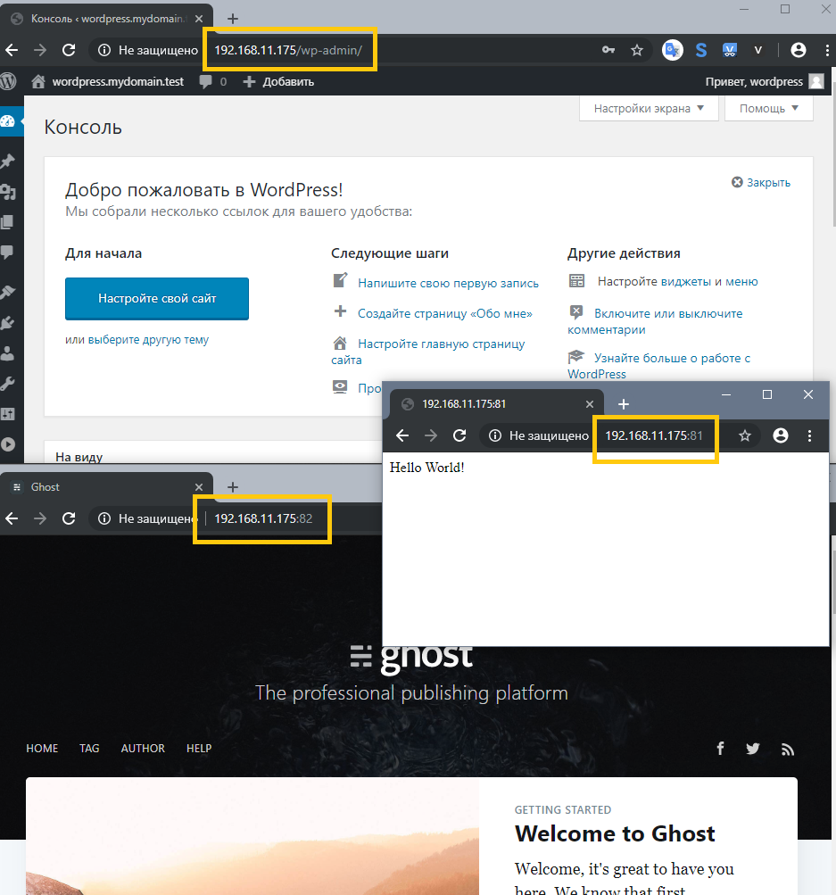

#### Роль для настройки web-сервера

#### Задание

Поднять vagrant-стенд с web-сервером и 3-мя разными сайтами на разных технологиях, например: 
 - nginx + php-fpm (laravel/wordpress) + python (flask/django) + js(react/angular);
 - nginx + java (tomcat/jetty/netty) + go + ruby;
 - что-то своё.

Реализация или на хостовой системе через конфиги в /etc, или deploy через docker-compose. Для усложнения можно попросить проекты у коллег с курсов по разработке. К сдаче примается vagrant-стенд с проброшенными на localhost портами web-сервера, каждый порт на свой сайт.

#### Результат

  Приложен Vagrantfile с Ansible provision, который подготавливает в каталоге /opt на виртуальной машине docker-compose стенд с необходимыми конфигурационными файлами. Для того чтобы запустить web-сервер, нужно в каталоге ```/opt``` выполнить команду ```sudo docker-compose up -d``` и дождаться развертывания приложений внутри контейнеров (около одной минуты).

 - [Vagrantfile](Vagrantfile);
 - [Ansible repo](ansible_repo/roles);
 - [docker-compose](ansible_repo/roles/web_server/templates/docker-compose.yml.j2);

  В результате запустится nginx, который предоставит доступ к следующим сервисам:

 - на 80/tcp - Wordpress (PHP+FPM + MySQL);
   - [конфиг nginx](ansible_repo/roles/web_server/templates/wp_nginx.conf.j2)
   - [конфиг php](ansible_repo/roles/web_server/templates/wp_php.ini.j2)
 - на 81/tcp - Hello World с использованием Python/Flask/uWSGI;
   - [конфиг nginx](ansible_repo/roles/web_server/templates/py_nginx.conf.j2)
   - приложение на [DockerHub](https://hub.docker.com/r/mbfx/flask_uwsgi_demo_app)
 - на 82/tcp - Ghost CMS (NodeJS + MySQL).
   - [конфиг nginx](ansible_repo/roles/web_server/templates/gh_nginx.conf.j2)


  Демонстрация:

