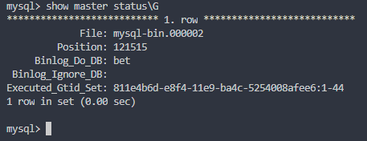
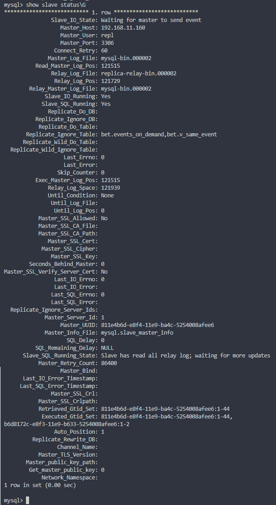
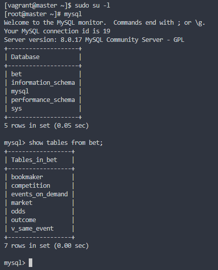
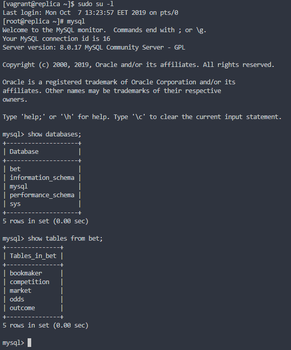
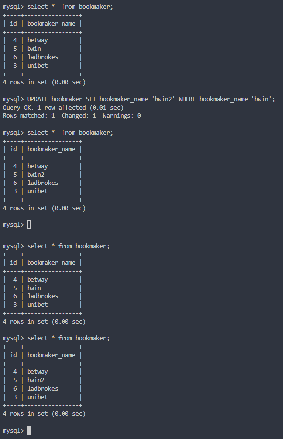
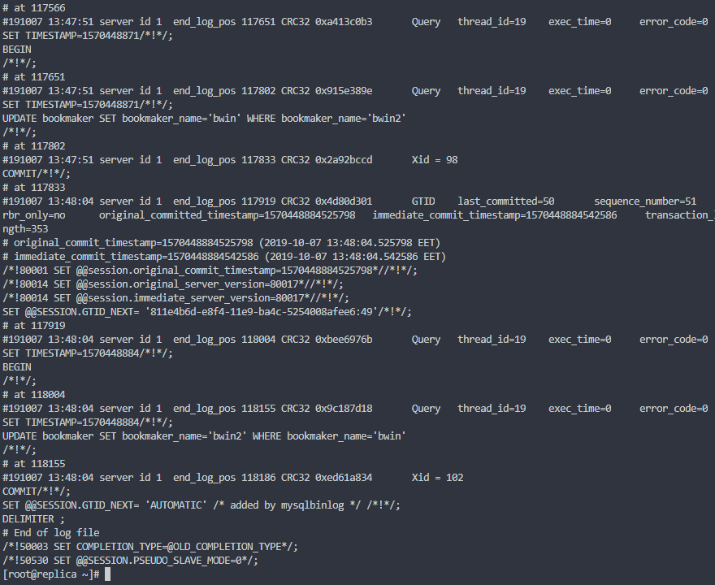

#### MySQL: развернуть базу из дампа и настроить репликацию

#### Задание

В материалах приложены ссылки на Vagrant-стенд для репликации и дамп базы bet.dmp. Базу нужно развернуть на мастере и сделать такую настройку, чтобы реплицировались таблицы:
- bookmaker;
- competition;
- market;
- odds;
- outcome.

Дополнительно: настроить GTID репликацию.

К сдаче:
- рабочий Vagrantfile;
- скрины или логи SHOW TABLES.

Дополнительно:
- конфиги;
- пример (в логе?) изменения строки и появления строки на реплике.

#### Результат

  Приложен Vagrantfile с Ansible provision, который развертывает master (в т.ч. базу bet.dmp) и replica (с настроенной GTID-репликацией и фильтрацией реплицируемых таблиц):
 - [Vagrantfile](Vagrantfile);
 - [Ansible repo](ansible_repo/roles);
 - [конфигурационный файл на master](ansible_repo/roles/mysql_master/templates/master.cnf.j2);
 - [конфигурационный файл на replica](ansible_repo/roles/mysql_replica/templates/replica.cnf.j2);

  Вывод команды ```SHOW MASTER STATUS\G``` на **master**:



  Вывод команды ```SHOW SLAVE STATUS\G``` на **master** (здесь видно, что работает GTID-репликация):



  Вывод команды ```SHOW TABLES FROM bet``` на **master**:



  Вывод команды ```SHOW TABLES FROM bet``` на **replica**:



  Демонстрация работы репликации:



  Демонстрация приёма изменений на **replica** в логе командой ```mysqlbinlog /var/lib/mysql/mysql-bin.000002``` (здесь также видно, что работает GTID-репликация):


